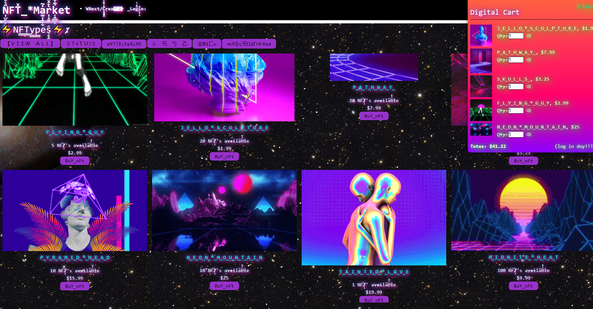

## NFT MARKET

# Table of Contents
  <ol>
    <li><a href="#description">Description</a></li>
    <li><a href="#usage">Usage</a></li>
    <li><a href="#appearance">Apperance</a></li>
    <li><a href="#links">Links</a></li>
    <li><a href="#contributors">Contributors</a></li>
    <li><a href="#license">License</a></li>
  </ol>

# Description

- As developers, we created an NFT Marketplace.
The page has a brutalist, vaporwave aesthetic interface that overwhelms the user with its design.
- User story:
As a web user, when I open up my NFT Market page, I want to be greeted with a clean, streamlined page-
# Usage

Built with
--- 
- [HTML](https://developer.mozilla.org/en-US/docs/Web/HTML)
- [Express.js](https://expressjs.com/)
- [CSS](https://developer.mozilla.org/en-US/docs/Web/CSS)
- [Node.js](https://nodejs.org/en/)
- [Heroku](https://dashboard.heroku.com/login)

# Appearance

# Links

[GitHub Link](https://github.com/pacoavocado/groupproject_3)

[Heroku Link](https://stark-wildwood-90610.herokuapp.com/)

# Contributors

[Tina Pham](https://github.com/tpham912)

[Micah C Conn](https://github.com/pacoavocado)

[Gulshun Eswani](https://github.com/geswani1)

[Patrick Price](https://github.com/Damerian00)

# License

Distributed under the MIT License 

